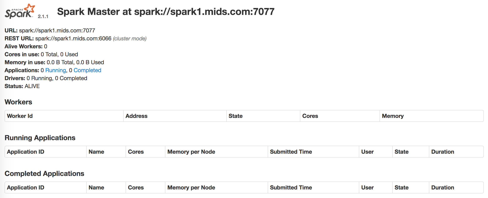
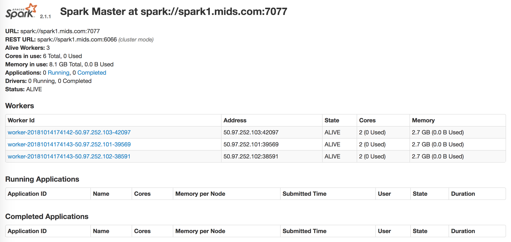

|Title |  Spark Installation |
|-----------|----------------------------------|
|Author | Kenneth Chen |
|Utility | IBM, Softlayer, Spark |
|Date | 10/08/2018 |

# Apache Spark Setup

# Setup 3 virtual servers in the cloud. 
Provision CENTOS 7 (os), 2 (CPU), 4GB (RAM), 100GB (local disk) 
```
$ slcli vs create --datacenter=sjc01 --hostname=spark1 --domain=mids.com --billing=hourly --cpu=2 --memory=4096 --disk=100 --os=CENTOS_7_64
$ slcli vs create --datacenter=sjc01 --hostname=spark2 --domain=mids.com --billing=hourly --cpu=2 --memory=4096 --disk=100 --os=CENTOS_7_64
$ slcli vs create --datacenter=sjc01 --hostname=spark3 --domain=mids.com --billing=hourly --cpu=2 --memory=4096 --disk=100 --os=CENTOS_7_64
```
Check the servers provisioned
```
$ slcli vs list

:..........:..........:...............:..............:............:........:
:    id    : hostname :   primary_ip  :  backend_ip  : datacenter : action :
:..........:..........:...............:..............:............:........:
: 63442913 :  spark1  : 50.97.252.101 : 10.53.47.13  :   sjc01    :   -    :
: 63442935 :  spark2  : 50.97.252.103 : 10.53.47.34  :   sjc01    :   -    :
: 63442941 :  spark3  : 50.97.252.102 : 10.53.47.30  :   sjc01    :   -    :
:..........:..........:...............:..............:............:........:
```
# Setup DNS (on all nodes)
To easily ssh with the name instead of the IP addresses, we will setup the DNS. You need to add the `spark1.mids.com` as well. 

```
# vi /etc/hosts

127.0.0.1     localhost.localdomain localhost
50.97.252.101  spark1.mids.com spark1
50.97.252.103  spark2.mids.com spark2
50.97.252.102  spark3.mids.com spark3
```

# Setup passwordless ssh
The idea is to `ssh` without password between nodes. `spark1` must be able to `ssh spark1`, `ssh spark2` and `ssh spark3`. You already know by now that to ssh using the name requires you to set up at `/etc/hosts`. Without password, it requires you to setup `ssh-keygen` generation. 

```
# ssh-keygen -f ~/.ssh/id_rsa -b 2048 -t rsa 
# cat ~/.ssh/id_rsa.pub >> ~/.ssh/authorized_keys 
# chmod 600 ~/.ssh/authorized_keys

# scp ~/.ssh/* root@50.97.252.103:/root/.ssh/
# scp ~/.ssh/* root@50.97.252.102:/root/.ssh/

# for i in spark1 spark2 spark3; do ssh-copy-id $i; done
```
`ssh-copy-id` will copy `id_rsa.pub` key to `authorized_keys` file (will be created) in other nodes. So when it tries to establish the connection, it will first ask the password of the node it's sshing into. 

To test the ssh passwordless for all nodes 

```
# vi test.sh
```
Copy the following script 
```
#!/bin/bash

# Edit node list
nodes="spark1 spark2 spark3"

# Test ssh configuration
for i in $nodes
 do echo -n "Testing ssh ${i}: "
 ssh ${i} "ssh ${i} date"
done
```
Run the script 
```
# chmod 755 test.sh
# ./test.sh

Testing ssh spark1: Sun Oct 14 17:27:07 CDT 2018
Testing ssh spark2: Sun Oct 14 17:27:08 CDT 2018
Testing ssh spark3: Sun Oct 14 17:27:09 CDT 2018
```

# Install Java, SBT and Spark (on all nodes)

Install SBT
```
# curl https://bintray.com/sbt/rpm/rpm | sudo tee /etc/yum.repos.d/bintray-sbt-rpm.repo
# yum install -y java-1.8.0-openjdk-devel sbt git
```
Set Jave path in `~/.bash_profile`. After you set the export path, you need to `source` it so that the path becomes activated. To test later, check the java version.
```
# echo export JAVA_HOME=\"$(readlink -f $(which java) | grep -oP '.*(?=/bin)')\" >> /root/.bash_profile
# source /root/.bash_profile

# $JAVA_HOME/bin/java -version

openjdk version "1.8.0_181"
OpenJDK Runtime Environment (build 1.8.0_181-b13)
OpenJDK 64-Bit Server VM (build 25.181-b13, mixed mode)
```
Install Spark
```
# curl https://d3kbcqa49mib13.cloudfront.net/spark-2.1.1-bin-hadoop2.7.tgz | tar -zx -C /usr/local --show-transformed --transform='s,/*[^/]*,spark,'
```
Set Spark path
```
# echo export SPARK_HOME=\"/usr/local/spark\" >> /root/.bash_profile
# source /root/.bash_profile
```
# Configure Spark (on spark1)

```
# cd $SPARK_HOME/conf/
# vi slaves

spark1
spark2
spark3
```

# Copy files to spark1
We will copy moby10b.txt and src directory into our spark1 node and check their directory in our node. 
```
# cd /root
# git clone https://github.com/MIDS-scaling-up/coursework.git
```
moby10b.txt and src directory
```
/root/coursework/week6/hw/apache_spark_introduction/moby10b.txt
/root/coursework/week6/hw/apache_spark_introduction/src/spark
```

# Start Spark
we will start spark from spark1 as master node. There are a few script you should be familiar with.  
```
sbin/start-master.sh - Starts a master instance on the machine the script is executed on
sbin/start-slaves.sh - Starts a slave instance on each machine specified in the conf/slaves file
sbin/start-all.sh - Starts both a master and a number of slaves as described above
sbin/stop-master.sh - Stops the master that was started via the bin/start-master.sh script
sbin/stop-slaves.sh - Stops all slave instances on the machines specified in the conf/slaves file
sbin/stop-all.sh - Stops both the master and the slaves as described above
```

Start the master and check if it's working at `http://<master_ip>:8080/` = `http://50.97.252.101:8080`
```
# $SPARK_HOME/sbin/start-master.sh

starting org.apache.spark.deploy.master.Master, logging to /usr/local/spark/logs/spark-root-org.apache.spark.deploy.master.Master-1-spark1.mids.com.out
```

<p align="center">
</p>
<p align="center">Figure 1. Spark</p>

Start the slaves, refresh the browser and check if all workers are now active. 
```
# $SPARK_HOME/sbin/start-slaves.sh
```

<p align="center">
</p>
<p align="center">Figure 2. Spark with 3 workers</p>

# Calculate Pi
```
# $SPARK_HOME/bin/run-example SparkPi
```

#### Question 1: What value of PI do you get? Why is the value not "exact"? For a hint, see `$SPARK_HOME/examples/src/main/python/pi.py` 

```
Pi is roughly 3.1411357056785283
```

## Going into Spark Shell

```
# $SPARK_HOME/bin/spark-shell

...
...
Spark session available as 'spark'.
Welcome to
      ____              __
     / __/__  ___ _____/ /__
    _\ \/ _ \/ _ `/ __/  '_/
   /___/ .__/\_,_/_/ /_/\_\   version 2.1.1
      /_/
         
Using Scala version 2.11.8 (OpenJDK 64-Bit Server VM, Java 1.8.0_181)
Type in expressions to have them evaluated.
Type :help for more information.

scala>
```
To learn more about Apache Spark API  
https://spark.apache.org/docs/latest/quick-start.html

We're going to read `moby10b.txt` in spark and analzye afterwards. 
```
scala> val textFile = sc.textFile("/root/coursework/week6/hw/apache_spark_introduction/moby10b.txt")
```

#### Question 2: How many lines does the file have?
```
scala> textFile.count()
res3: Long = 23244
```
#### Question 3: What is the first line?
```
scala> textFile.first()
res4: String = **The Project Gutenberg Etext of Moby Dick, by Herman Melville**
```

#### Question 4: How many lines contain the text "whale"?
```
scala> val linesWithWhale = textFile.filter(line => line.contains("whale"))
scala> linesWithWhale.count()
res5: Long = 1276
```

#### Question 5: How many output files (ignore _SUCCESS file) does Spark write when the file RDD (file.saveAsTextFile( outputDirectory)) is written to the output directory?

Answer: Spark writes 2 files 
```
part-00000  part-00001  _SUCCESS
```

**Execution**

Compile the java file in the `src` directory. Use the moby10b.txt as an input and specify the output directory. You must run the command from the `src` directory. 

```
# cd /root/coursework/week6/hw/apache_spark_introduction/src/

# javac -cp .:$SPARK_HOME/jars/* spark/SparkJava8Example.java
```

##### Sample 
```
# java -cp .:$SPARK_HOME/jars/* spark.SparkJava8Example /root/coursework/week6/hw/apache_spark_introduction/moby10b.txt /<yourOutputDirectory>
```

##### Real command
```
# java -cp .:$SPARK_HOME/jars/* spark.SparkJava8Example /root/coursework/week6/hw/apache_spark_introduction/moby10b.txt /root/hw6
```

#### Question 5b: Change the line: JavaRDD file = sc.textFile(inputFile); to: JavaRDD file = sc.textFile(inputFile,1); and rerun the sample. How many outfiles are created when the RDD is saved? Explain the difference.

Only one file is created, excluding `_SUCCESS`. 
```
part-00000  _SUCCESS
```
The RDD (Resilient Distributed Dataset) by definition tries to save files in partitions. So when the file is large, it will partition into several duplicates. Here we changed the parameters into 1, so it only saved the file in one dataset. 

**Execution**

You need to change the line in SparkJava8Example.java file. 
```
# cd /root/coursework/week6/hw/apache_spark_introduction/src/spark/

# grep "sc.textFile" SparkJava8Example.java
			JavaRDD<String> file = sc.textFile(inputFile);
   
# vi SparkJava8Example.java
/sc.textFile
<press> i

sc.textFile(inputfile,1)

<press> esc
:wq!
```
You also need to remake the java class file. So remove the existing class file first. After that, go one level up to `src` directory. 
```
# rm SparkJava8Example.class
# cd ..
```
You need to use a totally different directory even if you deleted the previous files in the same directory `hw6`.  

```
# javac -cp .:$SPARK_HOME/jars/* spark/SparkJava8Example.java
# java -cp .:$SPARK_HOME/jars/* spark.SparkJava8Example /root/coursework/week6/hw/apache_spark_introduction/moby10b.txt /root/hw6_1
```

#### Question 6: The text file moby10b.txt is the The Project Gutenberg Etext of Moby Dick. This file contains a Gutenberg preamble. Write a job that removes or filters out all the lines until the text "MOBY DICK; OR THE WHALE" and write this new RDD to disk. How many lines does our filtered file have?

#### Question 7: Using your filtered RDD, count the number of words. Non-letter characters (only a-z should be included) should be removed.

#### Question 8: Find the number of times each letter is used. The results should be sorted alphabetically, from a to z.

#### Question 9: Find the number of times each letter is used. The results should be sorted from most frequent to least frequent.

#### Question 10: Rewrite the filtered file such that each line is mirrored or reversed. What are the first 20 lines of the mirrored RDD?

# Jupyter Notebook, Pyspark

In order to answer question 6 to 10, I thought of analyzing moby10b.txt in pyspark. So I need to install python in Centos OS first. First Centos also has its own software collection. To install those, I first need to install SCL release (Software Collection). 

```
# sudo yum install centos-release-scl
# sudo yum install rh-python36 bzip2 pyspark jupyter
# python --version

Python 2.7.5
```

Since python 2.7.5 is the default version, we will update the version by bash. 
```
# scl enable rh-python36 bash
# python --version

Python 3.6.3
```

### Setting up Jupyter Notebook

You need to set up the configuration file for jupyter notebook to work in your browser. Remember, you're launching jupyter-notebook from the server. But you will get access to jupyter-notebook from your local machine browser. 

```
# jupyter notebook --generate-config

Writing default config to: /root/.jupyter/jupyter_notebook_config.py

```
Modifying the configuration file
```
# cd /root/.jupyter/
# vi jupyter_notebook_config.py
```
Copy the following script and paste it the jupyter_notebook_config.py
```
c = get_config()
c.NotebookApp.ip = '*'
c.NotebookApp.open_browser = False
c.NotebookApp.port = 8123
```
Launch jupyter-notebook
```
# jupyter-notebook
```

Go to your browser 
```
50.97.252.101:8123/?token ....
```

### Setting up Pyspark in Jupyter Notebook

I'd like to launch pyspark in jupyter notebook. There are two options to use `pyspark` in jupyter notebook.  
- Option1: When you'd call `# pyspark`, it will automatically launch jupyter-notebook and you can use `pyspark` in jupyter-notebook. It's fast.  
- Option2: You launch `# jupyter-notebook` and `import findspark` library. This is good when you want to work in different IDE. You just need to do `# pip install findspark` for later use in the jupyter notebook. 

I played around with the option1 but didn't succeed with the moby10b.txt. I detailed the procedure for future reference in optional installation below. So I tried with option2 and it worked. So Here I will continue with the option2. Checking the pyspark from earlier installation. 

https://github.com/kckenneth/Spark/blob/master/pyspark_setup.md

----------------
# Optional Installation
### I. Option1. Pyspark in Jupyter Notebook

```
# pyspark --version

Welcome to
      ____              __
     / __/__  ___ _____/ /__
    _\ \/ _ \/ _ `/ __/  '_/
   /__ / .__/\_,_/_/ /_/\_\   version 2.1.1
      /_/

Using Python version 3.6.3 (default, Mar 20 2018 13:50:41)
SparkSession available as 'spark'.
```
Once the installation is checked, we need to modify the export path of the `pyspark`. 
```
# vi /root/.bashrc
```
Copy and paste the following 
```
export PYSPARK_DRIVER_PYTHON=jupyter
export PYSPARK_DRIVER_PYTHON_OPTS='notebook'
```
To activate the .bashrc
```
# source /root/.bashrc
```
Launch the pyspark
```
# pyspark

    Copy/paste this URL into your browser when you connect for the first time,
    to login with a token:
        http://localhost:8123/?token=d23a6df8xxxxxxxxx
```
Change the localhost to my primary IP address: `50.97.252.101`. 

### II. Anaconda (Optional Installation) 

If you're starting from scratch, you'll need to install several apps. 

1. Anaconda3 (which requires bzip2)

```
# wget https://repo.continuum.io/archive/Anaconda3-4.3.0-Linux-x86_64.sh
# bash Anaconda3-4.3.0-Linux-x86_64.sh
```
Accept license agreeement, yes, and yes to the last question on 'prepend the PATH'. You need to start a new terminal, log into your account. This time if you call python by `# python` python will launch from Anaconda path. 
