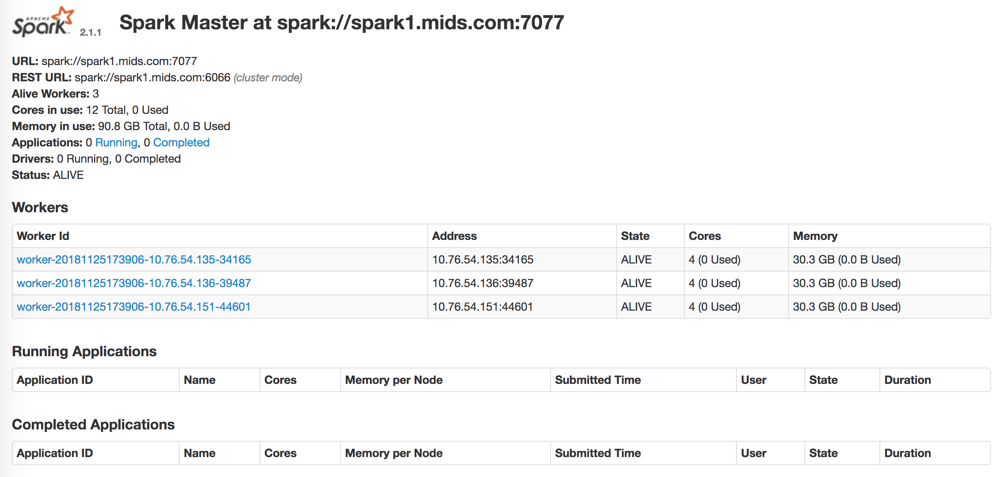

# Install Spark as a user

Install SBT
```
# curl https://bintray.com/sbt/rpm/rpm | sudo tee /etc/yum.repos.d/bintray-sbt-rpm.repo
# sudo yum install -y java-1.8.0-openjdk-devel sbt git
```
Set Jave path in `~/.bash_profile`. After you set the export path, you need to `source` it so that the path becomes activated. To test later, check the java version.
```
# echo export JAVA_HOME=\"$(readlink -f $(which java) | grep -oP '.*(?=/bin)')\" >> ~/.bash_profile
# source ~/.bash_profile

# $JAVA_HOME/bin/java -version

openjdk version "1.8.0_181"
OpenJDK Runtime Environment (build 1.8.0_181-b13)
OpenJDK 64-Bit Server VM (build 25.181-b13, mixed mode)
```
Install Spark
```
# curl -O https://d3kbcqa49mib13.cloudfront.net/spark-2.1.1-bin-hadoop2.7.tgz 
# sudo tar xvf spark-2.1.1-bin-hadoop2.7.tgz -C /usr/local --show-transformed --transform='s,/*[^/]*,spark,'
```
Set Spark path
```
# echo export SPARK_HOME=\"/usr/local/spark\" >> ~/.bash_profile
# source ~/.bash_profile
```
# Configure Spark (on spark1)

```
# cd $SPARK_HOME/conf/
# sudo vi slaves

spark1
spark2
spark3
```

# Start Spark
we will start spark from spark1 as master node. There are a few script you should be familiar with.  
```
sbin/start-master.sh - Starts a master instance on the machine the script is executed on
sbin/start-slaves.sh - Starts a slave instance on each machine specified in the conf/slaves file
sbin/start-all.sh - Starts both a master and a number of slaves as described above
sbin/stop-master.sh - Stops the master that was started via the bin/start-master.sh script
sbin/stop-slaves.sh - Stops all slave instances on the machines specified in the conf/slaves file
sbin/stop-all.sh - Stops both the master and the slaves as described above
```

Start the master and check if it's working at `http://<master_ip>:8080/` = `http://50.97.252.101:8080`
```
# sudo $SPARK_HOME/sbin/start-master.sh

starting org.apache.spark.deploy.master.Master, logging to /usr/local/spark/logs/spark-root-org.apache.spark.deploy.master.Master-1-spark1.mids.com.out
```
To start all other nodes, you need to give the permission to create log if necessary. In other nodes, do the following
```
# sudo chmod -R 777 /usr/local/spark
```
You can now start all other slave nodes. You'd see the spark cluster is now up and running with 3 nodes. 
```
# $SPARK_HOME/sbin/start-slaves.sh
```

<p align="center">
</p>
<p align="center">Figure 1. Spark with 3 nodes</p>

## Going into Spark Shell

```
# $SPARK_HOME/bin/spark-shell

...
...
Spark session available as 'spark'.
Welcome to
      ____              __
     / __/__  ___ _____/ /__
    _\ \/ _ \/ _ `/ __/  '_/
   /___/ .__/\_,_/_/ /_/\_\   version 2.1.1
      /_/
         
Using Scala version 2.11.8 (OpenJDK 64-Bit Server VM, Java 1.8.0_181)
Type in expressions to have them evaluated.
Type :help for more information.

scala>
```

